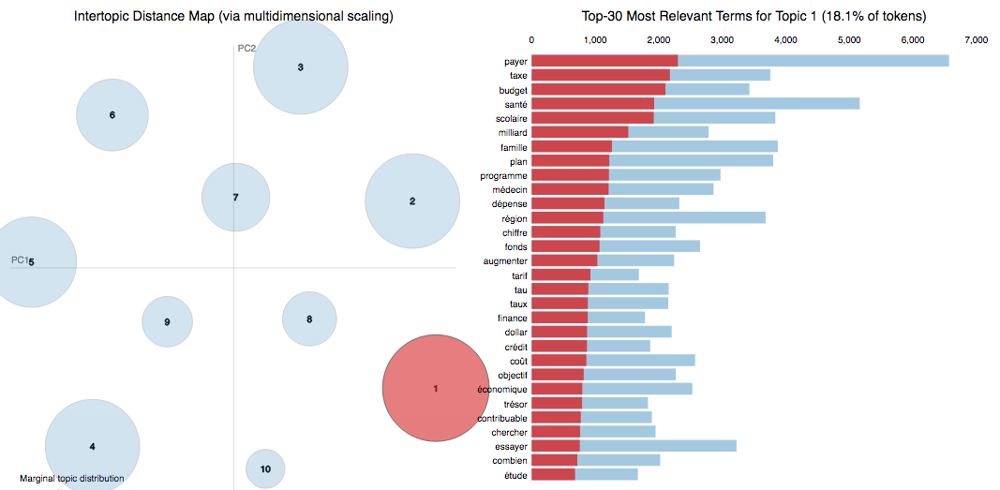

## Nouveau Projet #14
# Les mots de la 41e législature

### Méthodologie

Tout ce qui a été dit par les élu.e.s de l'[Assemblée nationale](http://www.assnat.qc.ca/fr/index.html) du Québec dans le cadre de leurs activités parlementaires au cours de la 41e législature a été analysé.

#### Quand?
Tous les propos enregistrés entre le 8 avril 2014 et 11 mai 2018 (moment où il a fallu livrer pour *Nouveau Projet*) ont été recueillis.

#### Qui?
On s'intéresse uniquement à ce qui a été dit par les quelque [140 personnes ayant été élues au cours de la période étudiée (**deputesAssnat.csv**)](deputesAssnat.csv).

#### Où?
À trois endroits&nbsp;:
* Les [débats au Salon bleu](http://www.assnat.qc.ca/fr/travaux-parlementaires/assemblee-nationale/41-1/index.html)
* Les travaux au cours de l'une ou l'autre des différentes [Commissions parlementaires](http://www.assnat.qc.ca/fr/travaux-parlementaires/commissions/index.html)
* Les [conférences et points de presse des élus](http://www.assnat.qc.ca/fr/actualites-salle-presse/conferences-points-presse/index.html)

#### Comment?
Le travail s'est effectué en trois étapes&nbsp;:

* Il s'agissait d'abord de sauvegarder localement les fichiers HTML des résultats de recherche pour les travaux parlementaires et les conférences et points de presse obtenus sur le site de l'Assemblée nationale et de les placer dans un répertoire appelé **sources**.
 Voici deux exemples&nbsp;:
  * [**p10.htm**](p10.htm) -> la 10e page des résultats de recherche pour les travaux parlementaires et
  * [**presse2015.html**](presse2015.html) -> la page des résultats de recherche pour tous les points de presse de 2015.

* Ensuite, un script ([**np14-extraction.py**](np14-extraction.py)) allait visiter chacun des quelque **1&nbsp;344 hyperliens** que contenaient les fichiers HTML sauvegardés dans la première étape. Chaque hyperlien menait à la retranscription de travaux parlementaires ou de points de presse durant la période étudiée. Le script découpait chacune des 1&nbsp;344 transcriptions en paragraphes. Pour chaque paragraphe, il enregistrait dans un fichier CSV (voici un exemple de ce qu'on a obtenu pour le [Journal des débats du 28 septembre 2017](20170928-assemblee-nationale.csv)) les informations suivantes&nbsp;:
  * URL de la transcription
  * Instance («&nbsp;Assemblée nationale&nbsp;», «&nbsp;Commission&nbsp;...&nbsp;» ou «&nbsp;Conférence de presse&nbsp;»)
  * Titre du fichier HTML
  * Date
  * Locuteur
  * Texte des paroles prononcées

* Enfin, il fallait ratisser un à un l'ensemble des 1&nbsp;344 fichiers CSV obtenus de l'opération précédente pour filtrer uniquement les paroles prononcées par les élus. On y parvenait à l'aide d'un autre script ([**np14-quiditquoi.py**](np14-quiditquoi.py)) qui retrouvait les élus en fonction des différentes façons de les identifier dans les transcriptions (toutes les façons possibles sont indiquées dans le fichier [**deputesAssnat.csv**](deputesAssnat.csv)). 
Toutes les paroles des élus étaient rassemblées dans un grand fichier CSV trop volumineux pour être reproduit ici, mais déposé dans le [Dataverse Scholars Portal](https://dataverse.scholarsportal.info/dataverse/assnat-41e-legislature-quebec). 
Le fichier ne contient que cinq colonnes (chaque ligne étant toujours un paragraphe) &nbsp;:
  * Le numéro d'identification de l'élu.e (tel qu'indiqué dans le fichier deputesAssnat.csv)
  * Le numéro de code du parti (PLQ:p1; PQ:p2; CAQ:p3; QS:p4; indépendants:p5)
  * La date où les mots ont été prononcés
  * L'URL de la source
  * Le texte

#### Quoi?
Une fois obtenu ce fichier central, différentes analyses étaient possibles. Toutes ne donnaient pas des résultats pertinents.

Par exemple, une lemmatisation et un étiquettage morpho-syntaxique ont été effectués à l'aide de l'outil [TreeTagger](http://www.cis.uni-muenchen.de/~schmid/tools/TreeTagger/). Il en a résulté différents fichiers de *tokens*&nbsp;: quatre pour chacun des partis représentés à l'Assemblée nationale et 140 pour chacun des élus ayant siégé au cours de la 41e législature. Voici un exemple du résultat pour le député sortant de Gouin, Gabriel Nadeau-Dubois ([**d092-tokens.csv**](d092-tokens.csv)).

Une modélisation thématique (*topic modeling*) a également été tentée, mais sans grands résultats. En utilisant la bibliothèque python d'apprentissage machine [Scikit Learn](http://scikit-learn.org/stable/), notamment l'[allocation de Dirichlet latente](https://fr.wikipedia.org/wiki/Allocation_de_Dirichlet_latente), il a été possible d'identifier les 10 thèmes les plus souvent abordés par les partis. Mais il était difficile d'identifier clairement ces thématiques. 
Je laisse ici les visualisations résultant de ces analyses. Peut-être y verrez-vous des choses qui ne me sautaient pas aux yeux&nbsp;:
* Thématiques du [Parti libéral](jhroy.ca/Visualisation_LDA_p1.html) ([Visualisation_LDA_p1.html](Visualisation_LDA_p1.html))
* Thématiques du [Parti québécois](jhroy.ca/Visualisation_LDA_p2.html) ([Visualisation_LDA_p2.html](Visualisation_LDA_p2.html))
* Thématiques de la [Coalition avenir Québec](jhroy.ca/Visualisation_LDA_p3.html) ([Visualisation_LDA_p3.html](Visualisation_LDA_p3.html))
* Thématiques de [Québec solidaire](jhroy.ca/Visualisation_LDA_p4.html) ([Visualisation_LDA_p4.html](Visualisation_LDA_p4.html))

*À compléter*
